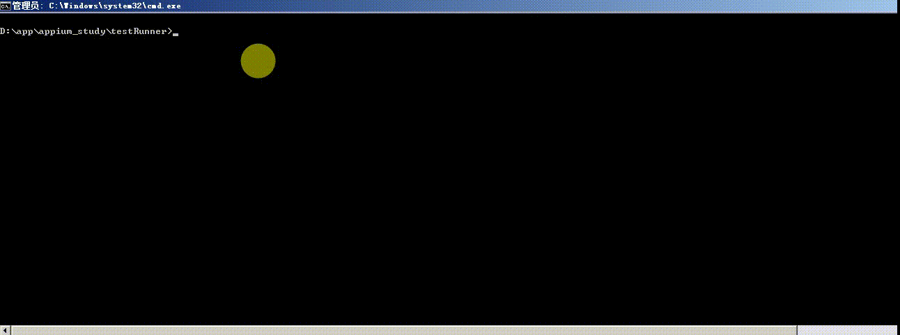

# 项目名及简介
* 此项目是在[appium](https://github.com/appium/appium)和[Selenium](https://github.com/SeleniumHQ/selenium)开源工具封装而成的自动化app和web测试工具

# 功能
* 都是基于python3
* 都是基于webdriver，大部分代码都可以通用，只是配置文件不一样
* APP监控了常用的men,cpu,fps
* 数据维护用的YMAL
* 邮件发送excel的测试报告
* 支持多设备andoird并行

# 用法

**下载项目:**

```
git clone git@github.com:284772894/appiumn_auto.git
```

**配置devices.yaml**

```
appium:
 - devices: JTJ4C16331013562
   port: 4723
   config: node D:\app\Appium\node_modules\appium\bin\appium.js  -p 4723 -bp 4733
   platformName: android
 - devices: MSM8926
   port: 4724
   config: node D:\app\Appium\node_modules\appium\bin\appium.js  -p 4724 -bp 4734
   platformName: android
```

**yaml**

* [case的api](mark.md)

```
--- 
- 
  element_info: cn.ibona.t1_beta:id/start_button
  find_type: by_id
  operate_type: click
  test_id: 1002
  test_intr: 登陆
- 
  element_info: cn.ibona.t1_beta:id/passwordEditText
  find_type: by_id
  operate_type: send_keys
  test_id: 1002
  text: 111111
- 
  element_info: cn.ibona.t1_beta:id/phoneNumberEditText
  find_type: by_id
  operate_type: send_keys
  text: 18576759587
- 
  element_info: cn.ibona.t1_beta:id/loginButton
  find_type: by_id
  operate_type: click
- 
  element_info: cn.ibona.t1_beta:id/toolbar
  find_type: by_id

```


**命名行运行:**

```
pyhton testRunner/runner.py
```

# 使用截图

* 运行方式



* APP运行情况


* 结果展示


# 其他
* 更多信息查看我的[更新日志](channel_log.md)


