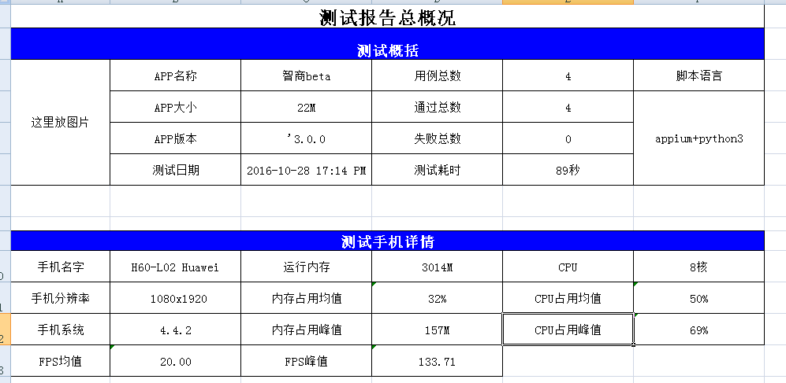
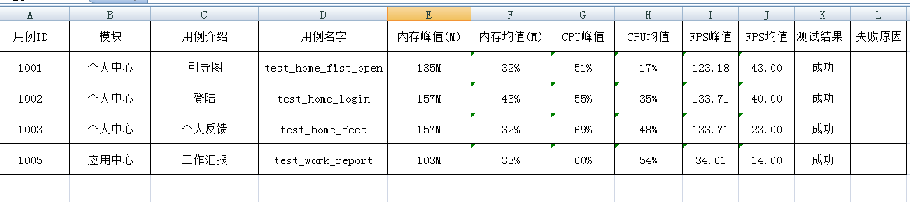
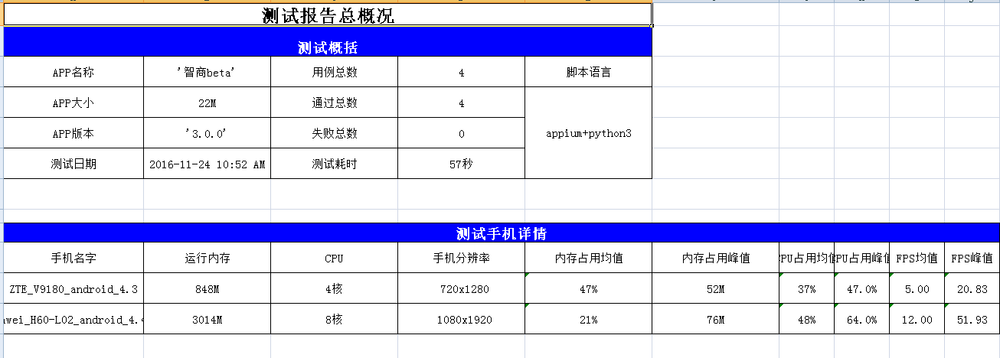
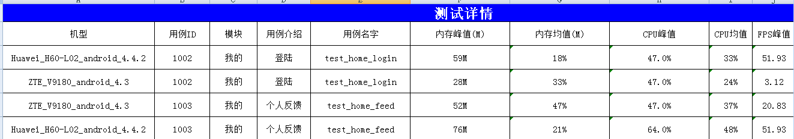
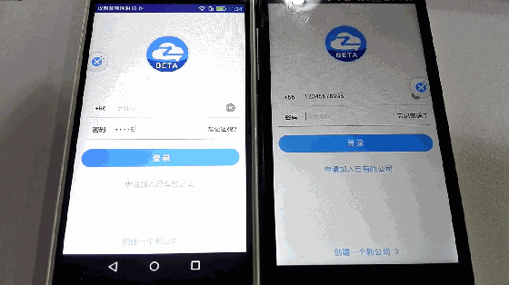
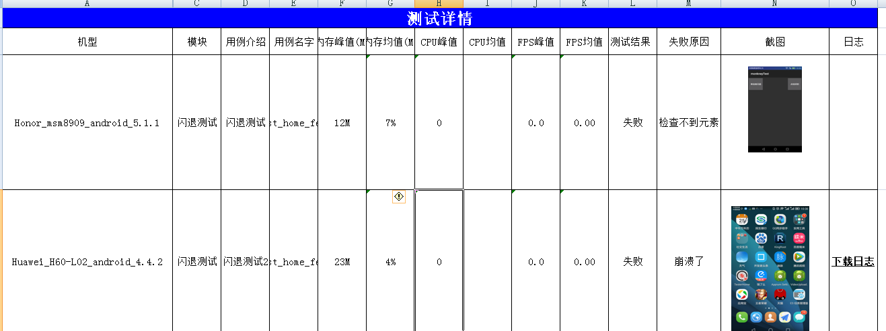

# 自动化测试平台
## 框架介绍
* 基于python3
* 基于app UI自动化，使用appium（可用于ios,和安卓）

### 2015-10-10 更新日志
*  Common 主要放一些全局变量，其他公用方法
*  img 主要放一些图片，测试的app文件
*  testBLL  三层
*  testDAL 三层
*  testModel 三层
*  testRunner 
  *  一个抽象入口，主要管理整个框架的setUpClass,tearDownClass，以及parametrize
  * 一个是真正的入口，调用抽象入口
	

## 2015-11-10 更新日志
* 引用yaml来配置测试案例，代替xml
* 更新了自定义日志函数
* 用例抽象化，如所有的地方只要修改testDriver.webChatHome.py 即可，其他地方无需修改

## 2016-1-19 更新日志
* 规范markdown语法

## 2016-3-25
* 更新了用例的管理，用例只许到D:\appium\testcase\module(项目模块)定义自己的用例：
* testCase目录编写相应的检查和执行操作即可
```yaml配置文件
 - element_info: com.xfb.user:id/home_fragment_arrow_left_img
   operate_type: click
   findElemtType: id
 - element_info: com.xfb.user:id/citydeals_item_title
   operate_type: null
   findElemtType: id
```
 * 第一个对象是操作
 * 第二个对象是检查点

* 结果展示优化
 * 新增截图
 * 新增调试日志和执行日志分开显示
``` 调试信息
 2016-03-25 18:03:14,098 - root - INFO - ----  test_check_home   START     ----
``` 
``` 执行日志
 test_click_home: OK
``` 
* 启动代码优化。使用setUpClass tearDownClass 代替setup,teardown。每次执行完所有case才会关闭app


## 2016-4-28 更新日志
* 更新了unittest参数化，每次只要  suite.addTest(TestInterfaceCase.parametrize(testShiBase)) 类，就可以执行这个类里面的所有case。入口变成了runner4.py

* 新增结果展示,采用的是pyh拼接的方式来生成html报告


## 2016-7-24更新日志

* 优化操作类

```
class getOperateElement():
    def __init__(self, driver=""):
        self.cts = driver
    def findElement(self, elemt_by, element_info):
        '''
        查找元素
        :param elemt_by:   查找类型,id,xpath等
        :param element_info: 具体元素参数，如xpath的值，id的值
        :return:
        '''
        try:
            WebDriverWait(self.cts, 10).until(lambda x: elements_by(elemt_by, self.cts, element_info))
            return True
        except selenium.common.exceptions.TimeoutException:
            return False
        except selenium.common.exceptions.NoSuchElementException:
            print("找不到数据")
            return False
    def operate_element(self, operate, elemen_by, element_info, *arg):
        '''
        所有的操作入口
        :param operate: 操作对应common中的click,tap等
        :param elemen_by: 对应common中的id,xpath,name等
        :param element_info: 详细的元素，如xpath的格式，如id,name的名字
        :param arg: 扩展字段传list
        :return:
        '''
        elements = {
            common.CLICK: lambda: operate_click(elemen_by, self.cts, element_info),
            common.TAP: lambda: operate_tap(elemen_by, self.cts, elemen_by, arg)
        }
        return elements[operate]()

# 点击事件
def operate_click(elemen_by,cts,element_info):
    elements_by(elemen_by, cts, element_info).click()

# 轻打x轴向右移动x单位，y轴向下移动y单位
def operate_tap(elemen_by,cts,element_info, xy=[]):
    elements_by(elemen_by, cts, element_info).tap(x=xy[0], y=xy[1])

# 封装常用的find标签
def elements_by(types, cts, element_info):
    elements = {
        common.ID : lambda :cts.find_element_by_id(element_info),
        common.XPATH: lambda :cts.find_element_by_xpath(element_info),
        common.NAME: lambda :cts.find_element_by_name(element_info)
    }
    return elements[types]()

```

# 2016-7-29 更新日志
* [封装appium-server启动](https://github.com/284772894/appiumn_auto/blob/master/testRunner/testServer.py)
* [schematics代替model层的功能](https://github.com/284772894/appiumn_auto/blob/master/testMode/BaseAppDevices.py)，完全取代传统的get set,并且还能验证字段的类型是否正确

# 2016-8-6 更新日志
* 使用命名的方式启动appium
* 优化用例编写类，以后只要改用例的yaml文件和用例case.py即可运行

```
# 这样调用用例即可
execCase(r'D:\appium\testcase\home\home_more_adv.yaml', test_id="2004", test_intr="首页广告", test_case="test_home_more_adv",isLast="1")

```

# 2016-8-26
* 更新测试报告，用excel展示
* 邮件发送测试报告


# 2016-9-5
* 三层架构重构整个系统，分为了model,dal,bll,common,testCase(主要编写用例),runner（入口）
* 更新记录内存，cpu,平均和最大峰值情况

# 2016-9-6
* 修复计算内存错误
* 优化代码解耦

# 2016-8-7
* 重构DAL调用DAL层问题，放到了common层里面去了


# 2016-9-21
* 新增记录运行日志，比如闪退了，现在保留最后一次测试日志。因为框架闪退后，会停止运行，可以根据最后一次造成闪退的日志找到问题点
	* 后续优化闪退后，会重新启动框架运行后面case,比较麻烦，暂时还没有好的思路
* 新增执行case失败后，截图到本地
* 新增操作和检查点的运行日志
* 后续优化记录日志和报告生成问题

# 2016-10-24 更新日志

* 编写配置[case的api](mark.md)
* 优化对每个操作步骤实行智能查找元素，如果元素不存在，截图记录错误日志
* 对xpath,左滑动，tag_name,clas_name的支持

# 2016-10-25 更新日志

* 调试对每个操作case的性能信息监控
* 优化代码PATH相对路径的使用

# 2016-10-26 更新日志
* 新增总统计FPS的支持

# 2016-10-28 更新日志
* 新增对每个case的fps,men,cpu的统计
* 把yaml和case文件放到项目中编写，之前是放到某个硬盘里面





# 2016-11-4 更新日志

* 集成selenium运行方式，用的chromedriver,建议使用phantomjs，只是简单的使用，后续工作需要可以继续优化
* 代码不用改变，只要设置devices.ini即可

```
[DEFAULT]
selenium_appium=selenium #appium 
[appium]
devices=DU2TAN15AJ049163
platformName=android
platformVersion=4.4.2
appPackage=cn.ibona.t1_beta
appActivity=cn.ibona.t1.main.ui.activity.SplashActivity
Remote=http://localhost:4723/wd/hub
appiumjs=node D:\\app\Appium\\node_modules\\appium\\bin\\appium.js
[selenium]
selenium_jar = java -jar D:\\app\\appium_study\\img\\selenium-server-standalone-3.0.1.jar
sel_remote=http://127.0.0.1:4444/wd/hub
open_url=http://182.254.228.211:9000/index.php/Admin/index/login.html

```

命名执行此框架：

```
python runner.py
```

# 2016-11-8 更新日志
* 更新命名规则
	* 源文件用首字母小写开头的名词命名
	* class首字母大写开头的名词和名称短语命名
	* 方法用动词命名
	
# 2016-11-9 更新日志
* 去掉手动输入包名，启动页面，版本等信息
* 新增多设备扩展更加设备名监控性能信息

# 2016-11-24 更新日志
* 支持多android设备并行

```
appium:
 - devices: JTJ4C16331013562
   port: 4723
   config: node D:\app\Appium\node_modules\appium\bin\appium.js  -p 4723 -bp 4733 -U JTJ4C16331013562
   platformName: android
 - devices: MSM8926
   port: 4724
   config: node D:\app\Appium\node_modules\appium\bin\appium.js  -p 4724 -bp 4734 -U MSM8926
   platformName: android

```
* 多设备监控运行信息
* 测试报告统计多设备的case情况




* 逐渐取消schematics

## app执行情况


# 2016-12-5
* 新增对多机闪退监控,[自己封装的jar包](https://github.com/284772894/CrashHandler)，应用到app的application中即可
	* 封装好的监控闪退日志外，另外发了一个http get请求到我的框架，框架启动了一个web server监控各个设备发来的闪退信息
* 本地开启apache记录日志和图片的方式，开发点击下载日志可以直接远程下载

```
PROTOCOL = "http://" #协议
APACHE_PATH = "D:/app/Apache2.2/htdocs/appium/log/" #apapche器的地址，开发可以在这个上面下载异常日志
SCREEN_IMG_PATH = "D:/app/Apache2.2/htdocs/appium/img/" # 截图地址
```

* 记录闪退日记情况

```
versionCode = 1
PRODUCT = H60-L02
MODEL = H60-L02
versionName = 1.0
SDK_INT = 19
java.lang.NullPointerException
	at com.example.monkneytest.MainActivity$1.onClick(MainActivity.java:35)
	at android.view.View.performClick(View.java:4446)
	at android.view.View$PerformClick.run(View.java:18480)
	at android.os.Handler.handleCallback(Handler.java:733)
	at android.os.Handler.dispatchMessage(Handler.java:95)
	at android.os.Looper.loop(Looper.java:136)
	at android.app.ActivityThread.main(ActivityThread.java:5314)
	at java.lang.reflect.Method.invokeNative(Native Method)
	at java.lang.reflect.Method.invoke(Method.java:515)
	at com.android.internal.os.ZygoteInit$MethodAndArgsCaller.run(ZygoteInit.java:864)
	at com.android.internal.os.ZygoteInit.main(ZygoteInit.java:680)
	at dalvik.system.NativeStart.main(Native Method)
```

* 测试闪退，case失败过程的新增截图


